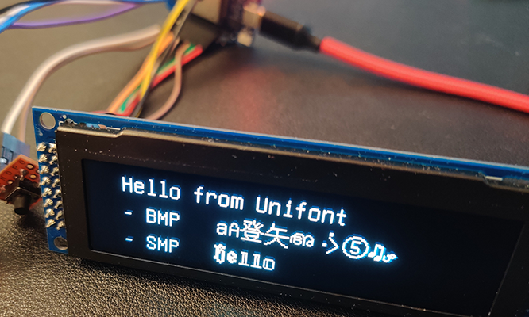

# u8g2-unifont-helper
Create your custom Unifont-based font for u8g2

## What is this for ?

### What is u8g2 ?

[u8g2](https://github.com/olikraus/u8g2) is a library to control OLED and LCD monochrome displays, mostly targeting Arduino and similar devices. It includes some pixel fonts, but also provides the tools to easily use any other bitmap font in your projects.

### What is Unifont ?

[Unifont](https://unifoundry.com/unifont/index.html) is a bitmap font (16x16), part of the GNU project. Its goal is to provide the pixel font with the largest coverage of Unicode.

### What are Unicode / BMP / SMP / planes ?

[Unicode](https://home.unicode.org/basic-info/faq/) ([Wikipedia](https://www.wikipedia.com/en/Unicode)) is a character encoding, that became a de-facto standard. It's goal is to include all the past, current, and future writing systems on Earth. It currently includes 143859 glyphs (out of more than a million possible ones, between 0 and 10FFFF).

Unicode is split in 17 so-called [planes](https://www.wikipedia.com/en/Plane_(Unicode)), each offering theoretically 65536 glyphs. Currently, not all of these planes do contain characters ; the main planes are 0 (also named Basic Multilingual Plane or BMP) and 1 (also named Supplementary Multilingual Plane). 

It is worth noting that Unicode is constantly evolving, with [work in progress](https://unicode.org/roadmaps/smp/) to standardize several languages that are not already included.

### So, what is this ?

When I launched a new ESP32-based project, I needed my OLED to display text in several different languages and scripts (latin, icelandic, japanese, hebrew)

I faced the following issues:

- u8g2 includes [several font files](https://github.com/olikraus/u8g2/wiki/fntgrpunifont) based on Unifont subsets, but none containing all the glyphs I needed at the same time
- It's impossible to use the whole Unifont, as it represents too much to store in embedded devices with very small memory modules
- u8g2 provides bdfconv, a CLI tool to create custom font files from a BDF encoded pixel font, but it's quite time-consuming to identify all the needed character ranges you want to include (my final command line ended up being `bdfconv -v -f 1 -m "0-127,128-255,256-383,1024-1279,1280-1327,1424-1535,8192-8303,9728-9983,12288-12351,12352-12447,12448-12543,19968,19978,19990,20117,20154,20219,20253,20309,20415,20493,21152,21205,21253,21315,21512,21517,21531,21764,22338,22402,22478,22675,22823,22825,22899,23019,23376,23429,23433,23455,23478,23487,23563,23665,23713,23830,23948,24059,24179,24230,24339,24613,24681,24693,24859,25104,25126,25163,26132,26178,26408,26412,26449,26463,26494,26519,27211,27468,27491,27915,28023,28779,29432,29483,30000,30001,30028,30331,30690,31070,31278,31354,31859,32000,32004,32005,32654,32819,33391,33457,33909,34276,34903,35328,35352,35441,35504,35895,35930,36062,36820,37117,37326,38525,38560,38915,38997,39080,39089,39764" unifont-13.0.06.bdf -o unifont_custom.c -n unifont_custom -d unifont-13.0.06.bdf`)

Something had to be done !

So this is basically a single-file webpage, that eases the task of generating your bdfconv command line. Choose the needed languages/scripts, copy the command line, run it, and voilà, you have your custom font file.

## How to

Go to [this page](https://stncrn.github.io/u8g2-unifont-helper/), just fill the form, and copy the generated command line

(detailed instructions coming...)

## Internals

- Preview pictures only include 1600 characters, even if the selected range is wider
- I'm compiling a custom version of Unifont BDF file, that includes both BMP and SMP planes. The official website is only offering a truncated version, with BMP only.
- I also generate the latest version of bdfconv, for both Linux and Windows (using mingw)
- Ugly JS in webpage? Ugly bash in the generating script? I'm not a developer, so cleaning PR are welcomed

## Next steps

- Update the generated webpage after each next release:
  - Unicode > add new ranges and generate
  - Unifont > update dependencies and generate
- Provide better control, mostly on CJK ideographs, maybe with precompiled hand-picked lists. Help from native speakers is welcomed !
- Offer possibility to filter / sort / search ranges, instead of just keeping the native Unicode list
- Compile bdfconv in WebAssembly. That would really be awesome to have the final font file generated directly in our browsers. PR welcomed !

## Issues

- A few glyphs are distorted in the preview pictures (ex: 00FF/255). That's a bdfconv issue. However, the glyphs are correct in the generated font file.
- Some glyphs are blank/missing! Some ranges contains no glyphs! As displayed on their project page, Unifont is missing many glyphs, mostly on the SMP. Feel free to draw the glyph you're missing and [contribute](https://unifoundry.com/unifont/unifont-utilities.html) to this part of the GNU project !

